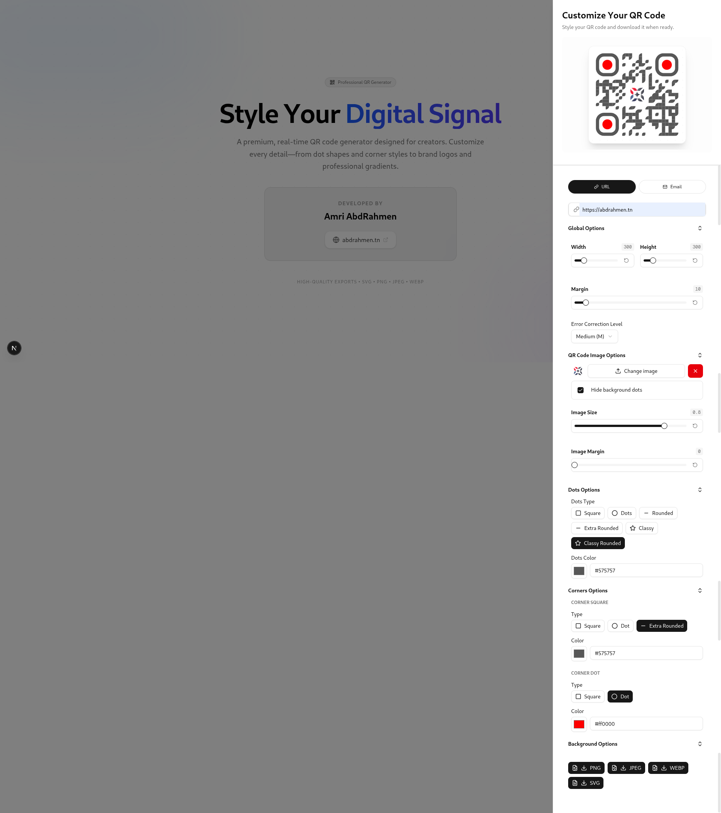

# 🎨 QR Code Styler

[](https://nextjs.org/)
[](https://www.typescriptlang.org/)
[](https://tailwindcss.com/)
[](https://react-hook-form.com/)
[](https://zod.dev/)

> A premium, real-time QR code generator designed for creators. Customize every pixel—from dot shapes and corner styles to brand logos and professional gradients. Export in high-quality formats like PNG, JPEG, SVG, and WEBP.



## ✨ Features

- **Real-Time Customization**: See changes instantly as you tweak settings.
- **Dot & Corner Styling**: Choose from square, dots, rounded, classy, and more with color pickers.
- **Logo Integration**: Upload and position brand images with adjustable size and margins.
- **Gradient Backgrounds**: Apply linear or radial gradients for a professional look.
- **Error Correction**: Select levels (L, M, Q, H) for reliability.
- **High-Quality Exports**: Download in PNG, JPEG, SVG, or WEBP formats.
- **Responsive Design**: Works seamlessly on desktop and mobile.
- **TypeScript-Powered**: Fully typed for reliability and developer experience.

## 🛠️ Tech Stack

- **Framework**: Next.js 16
- **Language**: TypeScript
- **Styling**: Tailwind CSS
- **UI Components**: Shadcn/ui (Radix UI primitives)
- **Form Handling**: React Hook Form + Zod validation
- **QR Generation**: qr-code-styling library
- **Icons**: Lucide React
- **Deployment**: Vercel

## 🚀 Installation

1. **Clone the repository**:
   ```bash
   git clone https://github.com/AbdRahmenAmri/qr-code-style.git
   cd qr-code-styler
   ```

2. **Install dependencies**:
   ```bash
   npm install
   # or
   yarn install
   ```

3. **Run the development server**:
   ```bash
   npm run dev
   # or
   yarn dev
   ```

4. **Open your browser** and navigate to `http://localhost:3000`.

## 📖 Usage

1. Click the "Create Custom QR" button to open the customization sheet.
2. Enter your QR data (URL, phone, email, etc.).
3. Customize dots, corners, background, and add a logo.
4. Preview in real-time.
5. Click a format chip (PNG, JPEG, etc.) to download your styled QR code.

### Example Customization
- **Dots**: Rounded with a custom color.
- **Corners**: Dot style for squares, square for dots.
- **Background**: Radial gradient from blue to purple.
- **Logo**: Your brand image centered with 40% size.

## 🤝 Contributing

Contributions are welcome! Please follow these steps:

1. Fork the repository.
2. Create a feature branch: `git checkout -b feature/your-feature`.
3. Commit your changes: `git commit -m 'Add some feature'`.
4. Push to the branch: `git push origin feature/your-feature`.
5. Open a pull request.

## 📄 License

This project is licensed under the MIT License. See the [LICENSE](LICENSE) file for details.

## 👨‍💻 Author

**Amri AbdRahmen**  
- Website: [abdrahmen.tn](https://abdrahmen.tn)  
- GitHub: [@AbdRahmenAmri](https://github.com/AbdRahmenAmri)  

Built with ❤️ for creators and designers.
